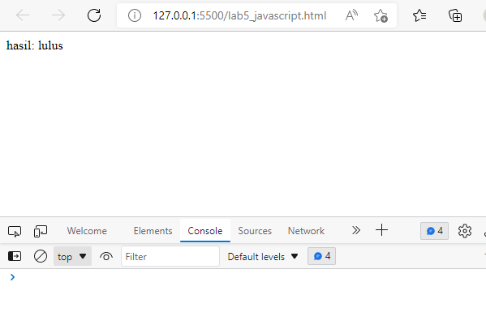

| Nama      | Aditya Bani Isro |
| ----------- | ----------- |
| NIM     | 312010134       |
| Kelas   | TI.20.A.1        |

## Langkah langkah praktikum 5
Disini saya menggunakan texy editor Visual Studio Code

Persiapan membuat dokumen HTML dengan nama file Lab5_javascript.html seperti berikut.

## Javascript Dasar
Pemakaian Alert sebagai property window.

Pemakaian method dalam objek

Pemakaian Prompt

Penggunaan operator switch untuk seleksi kondisi

## Pembuatan Form
Form Input

Form Button.

## HTML DOM
Pilihan menggunakan checkbox dengan perhitungan otomatis

## Pertanyaan dan Tugas
1. Buat script untuk melakukan validasi pada isian form

## Jawaban
Membuat validasi nama, No.Telp, Email

## 1. Nama
Disini saya akan memberikan validasi berupa inputan hanya boleh menggunakan Huruf/Alphabet saja. Contoh : Bani (benar), Bani04 (salah)

Penjelasan
- Membuat nama function Alphabet, dengan parameter dinamis yaitu (nilai,pesan)
- Data yang boleh dimasukkan adalah berupa "a-zA-Z"
- Jika selain data "a-zA-Z" ini dimasukkan, maka akan muncul pesan Alert "alert(pesan);"

## No. Telp
Pada bagian ini akan saya berikan validasi berupa hanya angka saja yang boleh di inputkan, contoh: 12345 (benar), 123AB (salah).

Penjelasan:

- var numberExp = /^[0-9]+$/; merupakan variabel numberExp yang diberi batasan validasi angka 0-9
- Arti Match pada "if(nilai.value.match(numberExp))" adalah string.match(), mencari string menggunakan Regular Expression (Regex)
- Jika salah atau inputan tidak benar maka akan ada pesan alert "alert(pesan);"

## Email
Pada email akan diberikan validasi masih berupa Regular Expression. Contoh: adityabani@gmail.com (benar), adityabani@gmail. (salah).

Penjelasan:

- membuat variabel email " var email = /^([a-zA-Z0-9_.+-])+@(([a-zA-Z0-9-])+.)+([a-zA-Z0-9]{2,4})+$/; " berupa huruf, angka dan simbol yang diperbolehkan dalam input sebuah email. Jika email salah maka akan ada pesan alert "alert(pesan);"

## Berikut Penulisan form yang benar

